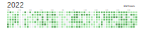
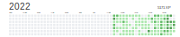

2022年真是魔幻的一年，5月中旬北京疫情管控开始变严，经历了第一次长达一个月的居家办公，然后三天做一次核酸成为了常态。11月中旬，小区第一次被封。正在感慨情况正变得更坏的时候，突然全面解封，全家又经历了一次感染变🐑。

2022年最幸福的事肯定就是女儿的出生。本来想着会在农历虎年出生，结果却生在了牛年的腊月二十七。当时媳妇还在规划着放假去吃海底捞呢，没想到晚上羊水缺破了。自己在这一年多了一个爸爸的新身份，身上的责任也更加重大。

2022年最遗憾的事就是姑奶奶去世，这也意味着妈妈最亲的长辈已经全部去世。姑奶奶之前身体还可以，不曾想因为拔牙去世了，因为疫情的原因没能回去。之前姑奶对我家的帮助很多，刚来北京的时候去姑奶家串亲戚，走的时候还偷偷塞了300块钱。

## 跑步

今年一共跑了1047公里，完成了每年1000公里的目标。12月因为🐑了，不然应该可以跑1100公里，明年目标继续1000公里。

**Keep年度报告**



## 读书

今年使用微信读书读了130个小时，读了10本书。今年读书缺乏输出，所以书读完之后很快就忘记了。

| 书名                                                         |
| ------------------------------------------------------------ |
| [认知觉醒](https://book.douban.com/subject/35193035/)        |
| [棋王](https://book.douban.com/subject/30330181/)            |
| [挪威的森林](https://book.douban.com/subject/27200257/)      |
| [别逗了，费曼先生](https://book.douban.com/subject/19989296/) |
| [福格行为模型](https://book.douban.com/subject/35594496/)    |
| [动物农场](https://book.douban.com/subject/4908879/)         |
| [鼠疫](https://book.douban.com/subject/30134903/)            |
| [局外人](https://book.douban.com/subject/30468519/)          |
| [献给阿尔吉侬的花束](https://book.douban.com/subject/35989392/) |
| [时间的礼物](https://book.douban.com/subject/30390651/)      |

**微信读书年度报告**



## 英语学习

因为女儿今年出生，想着学英语以后教女儿，今年9月份开始使用多邻国学习英语，也坚持了100多天，新的一年继续坚持。

## 工作

今年工作更多的是做逆向相关的工作，学习了Xposed、Frida等。并在工作中大量的使用Python语言。新的一年希望工作一切顺利，在工作中也能获得更多的成长。

## 新年计划

今年目标：
1. 跑1000公里。
2. 每天在微信读书读30分钟书。
3. 每天LeetCode刷一道题。
4. 每周看一部电影。
5. 每天在多邻国打卡。
6. 改掉熬夜的习惯。
7. 少刷短视频。

