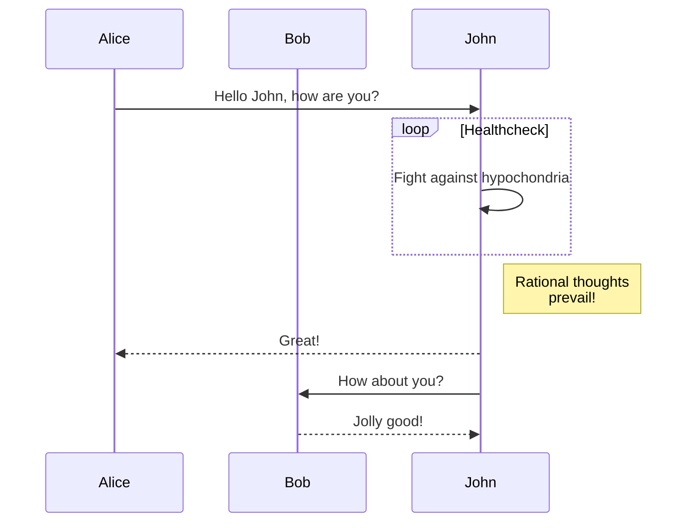

---
title: 博客
date: 2023-05-16T01:04:00.000Z
featured_image: https://images.unsplash.com/photo-1471899236350-e3016bf1e69e?ixlib=rb-4.0.3&q=85&fm=jpg&crop=entropy&cs=srgb
draft: false
tags: []
categories: []
comment : true
---


## ShortCode

### Spotify

在`shortcodes`目录下下创建`spotify.html`

```html
<!--
Parameters:
    type - (Required) album / track / playlist / artist
    id - (Required) Target ID
    width - (Optional) width
    height - (Optional) height
-->

{{ if .IsNamedParams }}
<iframe src="https://open.spotify.com/embed/{{ .Get "type" }}/{{ .Get "id" }}"
    width="{{ default "100%" (.Get "width") }}"
    height="{{ default "380" (.Get "height") }}"
    frameborder="0"
    allowtransparency="true"
    allow="encrypted-media"></iframe>
{{ else }}
<iframe src="https://open.spotify.com/embed/{{ .Get 0 }}/{{ .Get 1 }}"
    width="{{ default "100%" (.Get 2) }}"
    height="{{ default "380" (.Get 3) }}"
    frameborder="0"
    allowtransparency="true"
    allow="encrypted-media"></iframe>
{{ end }}
```



### Aplayer

在`shortcodes`目录下下创建`aplayer.html`

```html
<meting-js server="{{ .Get "server" }}"  url="{{ .Get "url" }}" name="{{ .Get "name" }}" cover="{{ .Get "cover" }}" type="{{ .Get "type" }}" id="{{ .Get "id" }}"></meting-js>
```
在custom.html中添加js引用

```html
<!-- require APlayer -->
<script>
    var meting_api='https://meting-api.malinkang.com/api?server=:server&type=:type&id=:id&auth=:auth&r=:r';
</script>
<link rel="stylesheet" href="https://cdn.jsdelivr.net/npm/aplayer/dist/APlayer.min.css">
<script src="https://cdn.jsdelivr.net/npm/aplayer/dist/APlayer.min.js"></script>
<!-- require MetingJS -->
<script src="https://cdn.jsdelivr.net/npm/meting@2/dist/Meting.min.js"></script>
```



### Mermaid

参考[官方文档](https://gohugo.io/content-management/diagrams/)



### Neodb

```html
{{ $dbUrl := .Get 0 }}
{{ $dbApiUrl := "https://neodb.social/api/catalog/fetch?url=" }}
{{ $dbFetch := getJSON $dbApiUrl $dbUrl }}

{{ if $dbFetch }}
    {{ $itemRating := 0 }}{{ with $dbFetch.rating }}{{ $itemRating = . }}{{ end }}
    <div class="db-card">
        <div class="db-card-subject">
            <div class="db-card-post"></div>
            <div class="db-card-content">
                <div class="db-card-title"><a href="{{ $dbUrl }}" class="cute" target="_blank" rel="noreferrer">{{ $dbFetch.title }}</a></div>
                <div class="rating"><span class="allstardark"><span class="allstarlight" style="width:{{ mul 10 $itemRating }}%"></span></span><span class="rating_nums">{{ $itemRating }}</span></div>
                <div class="db-card-abstract">{{ $dbFetch.brief }}</div>
            </div>
            <div class="db-card-cate">{{ $dbFetch.category }}</div>
        </div>
    </div>
{{else}}
    <p style="text-align: center;"><small>远程获取内容失败，请检查 API 有效性。</small></p>
{{end}}
```

css样式

```css
/* db-card -------- start*/
.db-card{margin:2.5rem 3rem;background:var(--card-background);border-radius: 7px;box-shadow: 0 6px 10px 0 #00000053;}
.db-card-subject{display: flex;align-items:flex-start;line-height:1.6;padding:12px;position:relative;}
.dark .db-card{background:var(--card-background);}
.db-card-content {flex:1 1 auto;}
.db-card-post {width: 96px;margin-right: 15px;display: flex;flex: 0 0 auto;}
.db-card-title {margin-bottom: 3px;font-size: 14px;color: var(--card-text-color-main);;}
.db-card-title a{text-decoration: none!important}
.db-card-abstract,.db-card-comment{font-size:13px;overflow: scroll;max-height:5rem;color: var(--card-text-color-main);;}
.db-card-cate{position: absolute;top:0;right:0;background:#f99b01;padding:1px 8px;font-size:small;font-style:italic;border-radius:0 8px 0 8px;text-transform:capitalize;}
.db-card-post img{width: 96px!important;height: 96px!important;border-radius: 4px;-o-object-fit: cover;object-fit: cover;}
.rating{margin: 0 0 5px;font-size:13px;line-height: 1;display: flex;align-items: center;}
.rating .allstardark{position:relative;color: #f99b01;height: 16px;width: 80px;background-size: auto 100%;margin-right: 8px;background-repeat: repeat;background-image: url(data:image/svg+xml;base64,PHN2ZyBjbGFzcz0iaWNvbiIgdmlld0JveD0iMCAwIDEwMjQgMTAyNCIgeG1sbnM9Imh0dHA6Ly93d3cudzMub3JnLzIwMDAvc3ZnIiB3aWR0aD0iMzIiIGhlaWdodD0iMzIiPjxwYXRoIGQ9Ik05MDguMSAzNTMuMWwtMjUzLjktMzYuOUw1NDAuNyA4Ni4xYy0zLjEtNi4zLTguMi0xMS40LTE0LjUtMTQuNS0xNS44LTcuOC0zNS0xLjMtNDIuOSAxNC41TDM2OS44IDMxNi4ybC0yNTMuOSAzNi45Yy03IDEtMTMuNCA0LjMtMTguMyA5LjMtMTIuMyAxMi43LTEyLjEgMzIuOS42IDQ1LjNsMTgzLjcgMTc5LjEtNDMuNCAyNTIuOWMtMS4yIDYuOS0uMSAxNC4xIDMuMiAyMC4zIDguMiAxNS42IDI3LjYgMjEuNyA0My4yIDEzLjRMNTEyIDc1NGwyMjcuMSAxMTkuNGM2LjIgMy4zIDEzLjQgNC40IDIwLjMgMy4yIDE3LjQtMyAyOS4xLTE5LjUgMjYuMS0zNi45bC00My40LTI1Mi45IDE4My43LTE3OS4xYzUtNC45IDguMy0xMS4zIDkuMy0xOC4zIDIuNy0xNy41LTkuNS0zMy43LTI3LTM2LjN6TTY2NC44IDU2MS42bDM2LjEgMjEwLjNMNTEyIDY3Mi43IDMyMy4xIDc3MmwzNi4xLTIxMC4zLTE1Mi44LTE0OUw0MTcuNiAzODIgNTEyIDE5MC43IDYwNi40IDM4MmwyMTEuMiAzMC43LTE1Mi44IDE0OC45eiIgZmlsbD0iI2Y5OWIwMSIvPjwvc3ZnPg==);
}
.rating .allstarlight{position: absolute;left: 0;color: #f99b01;height:16px;overflow: hidden;background-size: auto 100%;background-repeat: repeat;background-image: url(data:image/svg+xml;base64,PHN2ZyBjbGFzcz0iaWNvbiIgdmlld0JveD0iMCAwIDEwMjQgMTAyNCIgeG1sbnM9Imh0dHA6Ly93d3cudzMub3JnLzIwMDAvc3ZnIiB3aWR0aD0iMzIiIGhlaWdodD0iMzIiPjxwYXRoIGQ9Ik05MDguMSAzNTMuMWwtMjUzLjktMzYuOUw1NDAuNyA4Ni4xYy0zLjEtNi4zLTguMi0xMS40LTE0LjUtMTQuNS0xNS44LTcuOC0zNS0xLjMtNDIuOSAxNC41TDM2OS44IDMxNi4ybC0yNTMuOSAzNi45Yy03IDEtMTMuNCA0LjMtMTguMyA5LjMtMTIuMyAxMi43LTEyLjEgMzIuOS42IDQ1LjNsMTgzLjcgMTc5LjEtNDMuNCAyNTIuOWMtMS4yIDYuOS0uMSAxNC4xIDMuMiAyMC4zIDguMiAxNS42IDI3LjYgMjEuNyA0My4yIDEzLjRMNTEyIDc1NGwyMjcuMSAxMTkuNGM2LjIgMy4zIDEzLjQgNC40IDIwLjMgMy4yIDE3LjQtMyAyOS4xLTE5LjUgMjYuMS0zNi45bC00My40LTI1Mi45IDE4My43LTE3OS4xYzUtNC45IDguMy0xMS4zIDkuMy0xOC4zIDIuNy0xNy41LTkuNS0zMy43LTI3LTM2LjN6IiBmaWxsPSIjZjk5YjAxIi8+PC9zdmc+);}
@media (max-width:550px) {
	.db-card{margin:0.8rem 1rem;}
	.db-card-comment{display: none;}
}
/* db-card -------- end */
```



## 引用


这里写引用内容，实际使用记得换成双括号。



## 参考

* https://www.sleepymoon.cyou/2023/hugo-first-build-furnish/