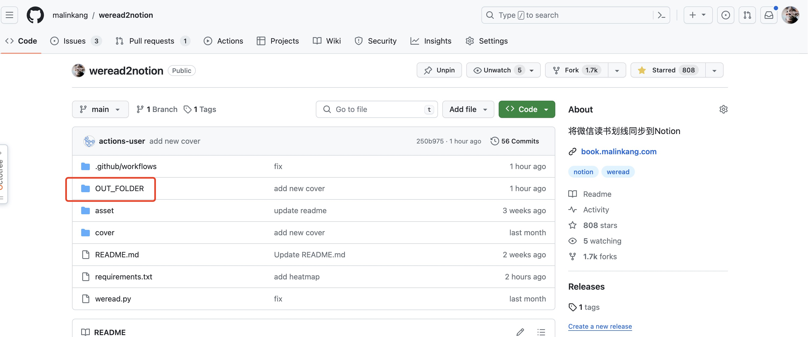

## 升级

如果你是新用户，可以直接跳过这一步。

打开你Fork的项目，点击Sync fork进行同步

## 权限

确保你打开了读写权限。

依次选择Settings->Actions->General，然后下拉，找到Workflow permissions，如果没有选中Read and write permissions，请选中，然后点下面的save保存。

## 设置NAME

设置这个Name用来展示在热力图上。

依次选择Settings->Secrets and variables -> New repository secret.

输NAME和Secret，然后点 Add secret保存即可。

## 手动运行

配置完成之后，你就可以手动运行一下。

最终生成的图保存在OUT_FOLDER文件夹下。

