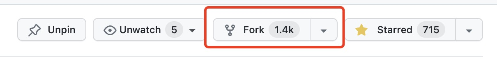
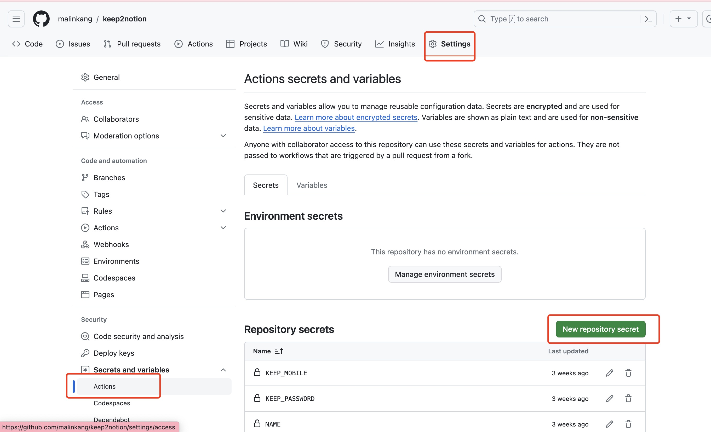

* [预览效果](https://malinkang.notion.site/7c556041c7fd4e21a6713673b6168fd4?pvs=4)

## 使用

### Fork工程

打开[Keep2Notion](https://github.com/malinkang/keep2notion)，点击右上角的Fork（顺便点个star谢谢）

### 复制Notion模板

1. 浏览器打开模板[https://malinkang.notion.site/9f43e44a009243b5b0c242e35d83178d?pvs=74](https://malinkang.notion.site/9f43e44a009243b5b0c242e35d83178d?pvs=74)，点击右上角的Duplicate复制。

2. 打开你刚复制的模板，点击右上角的三个点，找到`Connections`，然后添加你创建的Integration。不知道如何创建Integration，可以参考

3. 点击右上角的Share，然后点击Copy link获取页面的链接，后面会用到。

### 在Github的Secrets中添加变量

1. 打开你fork的工程，点击Settings->Secrets and variables->New repository secret

依次输入如下值：

* KEEP_MOBILE：注册Keep的手机号
* KEEP_PASSWORD：Keep密码
* NOTION_TOKEN：你创建的Token.
* NAME：热力图标题
* NOTION_PAGE：你复制的模板的链接

## 捐赠

如果你觉得项目对你有帮助，可以捐赠。我也会不断的优化项目，并做出其他开源的项目。

### 微信

### 支付宝

## 付费解答

有问题先自行解决，往往失败都是一些小细节没注意导致的。我的文档写的已经足够详细，按照文档来操作基本都能成功。你也可以尝试在群里咨询。不要直接加我微信来让我来解答，这个项目我已经投入了大量时间来开发维护，实在没有更多的精力来一对一解答。如果实在解决不了，可以付费一对一咨询，30元一位。付完款可以微信私聊我。

## 群

欢迎加入微信群讨论。使用中遇到的任何问题，包括Notion的使用，微信读书组队打卡，后续的更新都会在群里讨论。

