## 使用

 
Weread2Notion和Weread2Notion-Pro是两个不同的项目，模板也不相同，切勿用错模板。

* Weread2Notion-Pro教程：[https://malinkang.com/posts/weread2notion-pro/](https://malinkang.com/posts/weread2notion-pro/)
* 热力图使用教程：[https://malinkang.com/posts/github_heatmap/](https://malinkang.com/posts/github_heatmap/)


### Fork工程

打开[Weread2Notion](https://github.com/malinkang/weread2notion)，点击右上角的Fork（顺便点个star谢谢）

### 权限

确保你打开了读写权限。

依次选择Settings->Actions->General，然后下拉，找到Workflow permissions，如果没有选中Read and write permissions，请选中，然后点下面的save保存。

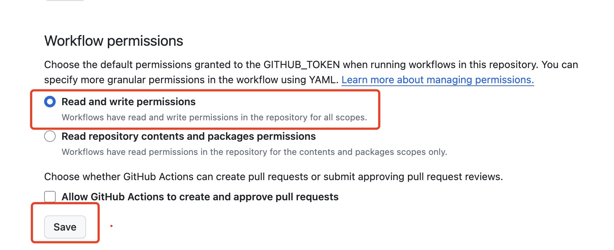

### 获取微信读书Cookie

1. 浏览器打开[网页版微信读书](https://weread.qq.com/)扫码登录
2. 按F12进入开发者模式，依次点网络->文档，然后选中weread.qq.com，下拉找到Cookie，复制Cookie值

 
如果没有内容显示，请刷新下浏览器。

建议使用Chrome浏览器，有的小伙伴使用QQ浏览器拿到的Cookie一直不能用。


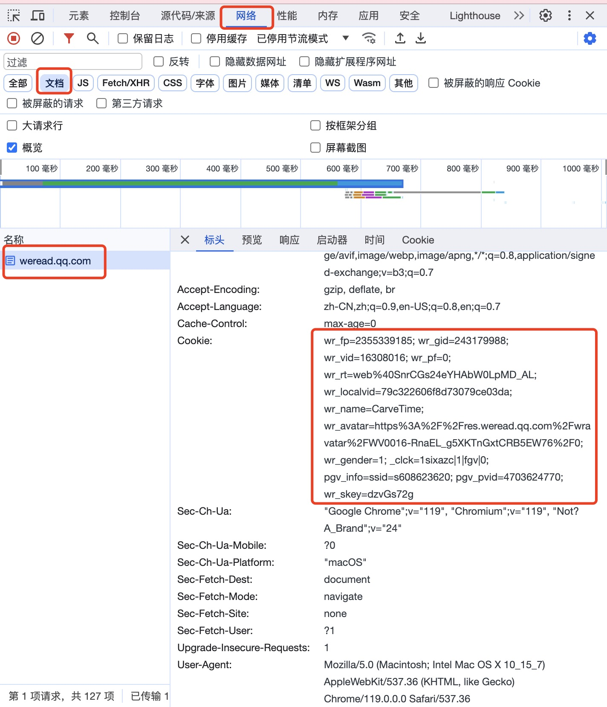

### 获取NotionToken

1. 浏览器打开[https://www.notion.so/my-integrations](https://www.notion.so/my-integrations)点击New integration按钮，输入name后点Submit。

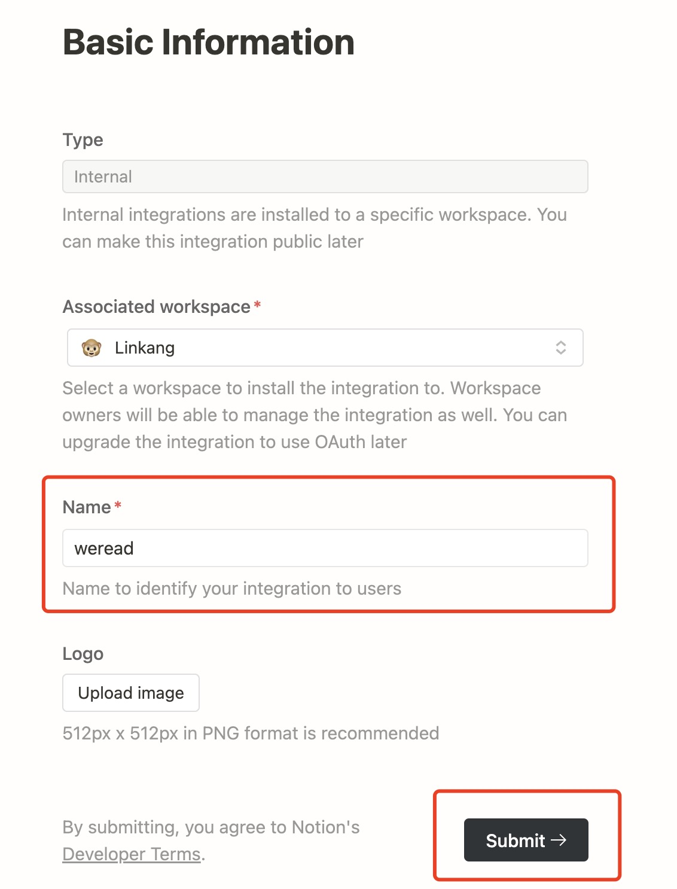

2. 提交完成后，进入Secrets页面，先点击Show，然后点击Copy复制，后面需要用到

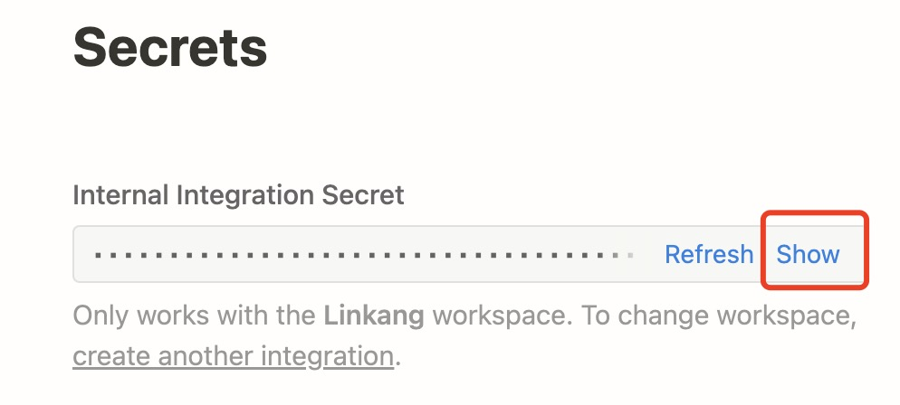

### 复制Notion模板

1. 浏览器打开模板[https://malinkang.notion.site/e27842548a6d4a81bc7aea736d90d6dd?v=b255858d3eaa409f97f1ecb32a14a5b6&pvs=4](https://malinkang.notion.site/e27842548a6d4a81bc7aea736d90d6dd?v=b255858d3eaa409f97f1ecb32a14a5b6&pvs=4)，点击右上角的Duplicate复制。

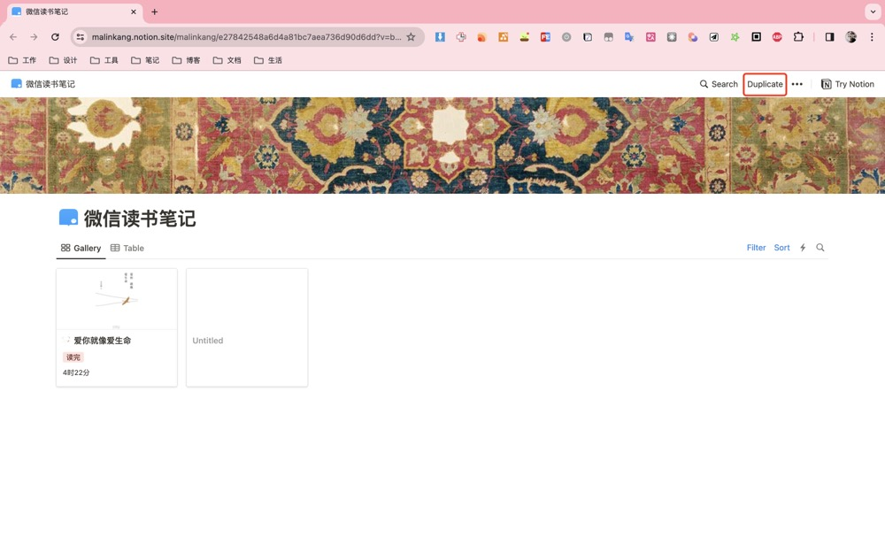

2. 打开你刚复制的模板，点击右上角的三个点，找到`Connections`，然后添加你创建的Integration。

3. 点击右上角的Share，然后点击Copy link获取database的链接，获取链接后比如 https://malinkang.notion.site/e27842548a6d4a81bc7aea736d90d6dd?v=b255858d3eaa409f97f1ecb32a14a5b6&pvs=4 中间的e27842548a6d4a81bc7aea736d90d6dd就是DatabaseID
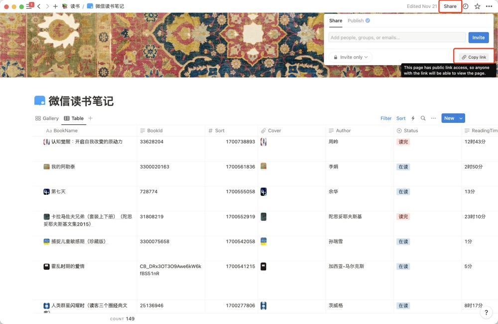

### 在Github的Secrets中添加变量

1. 打开你fork的工程，点击Settings->Secrets and variables->New repository secret

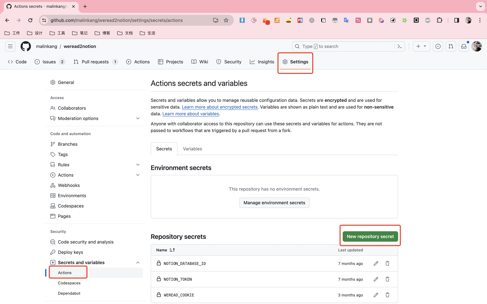

2. Name输入WEREAD_COOKIE，Secret输入框中填入你前面获取的微信读书Cookie，然后点击Add secret

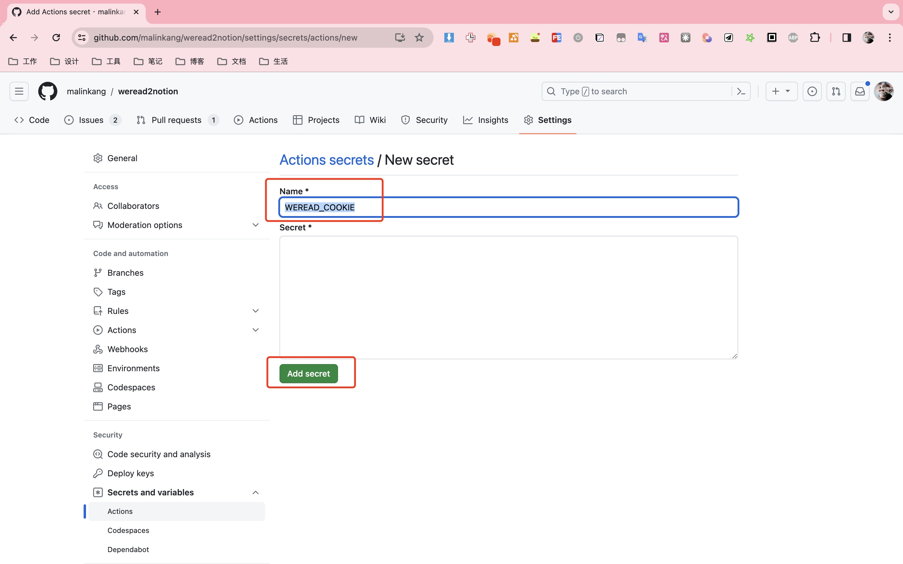

3. 同理，继续点击New repository secret，分别增加变量NOTION_TOKEN和NOTION_DATABASE_ID。最终的结果如下图所示。

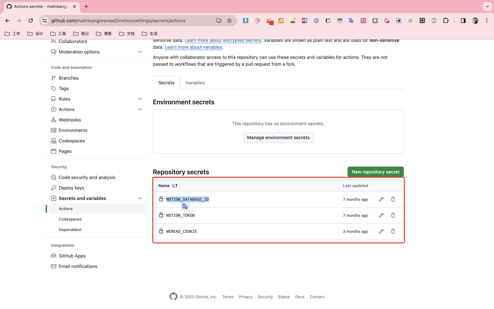

 注意这三个变量名一定要填写正确，一个字母都不能错，否则会同步失败。之前遇到过有的同学NOTION_DATABASE_ID写成NOTION_DATEBASE_ID。

### 运行

上面配置完成之后，打开你Fork的项目，依次点击Actions->weread sync-> Run workflow，就可以运行了。

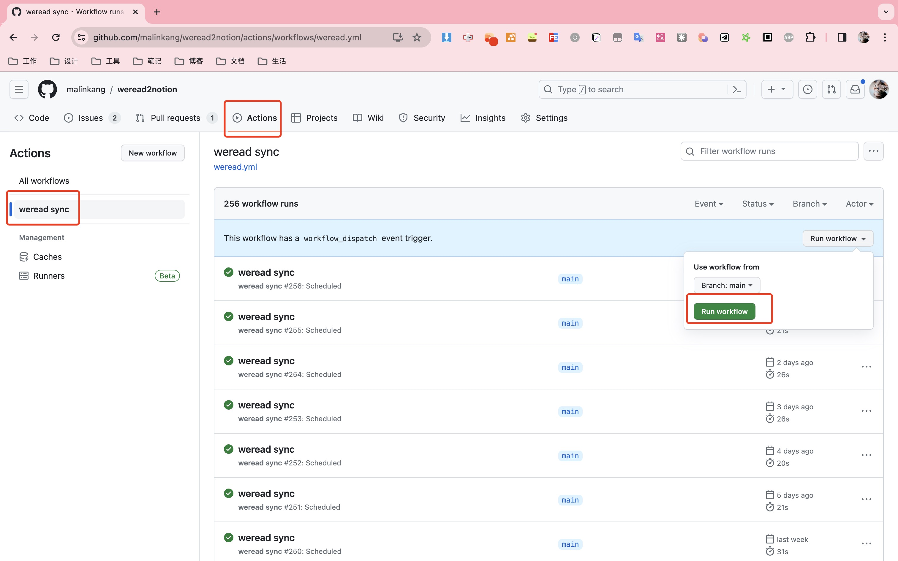

## 问题排查

1. 可以点击你Fork项目的Action，查看运行状态，绿色是成功，红色是失败。

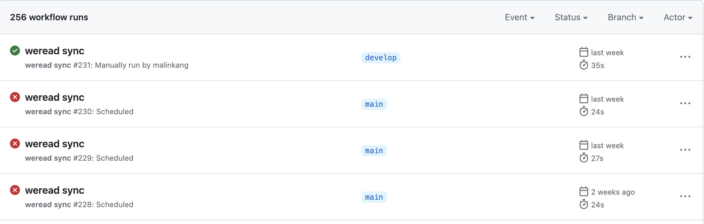

 运行成功，只代表程序没有出错，不代表就一定同步数据，比如微信Cookie过期就不会报错。所以如果运行成功，Notion中没有数据的话，也可以通过下面第2步来查看日志

2.可以点进去查日志，来自行排查问题。

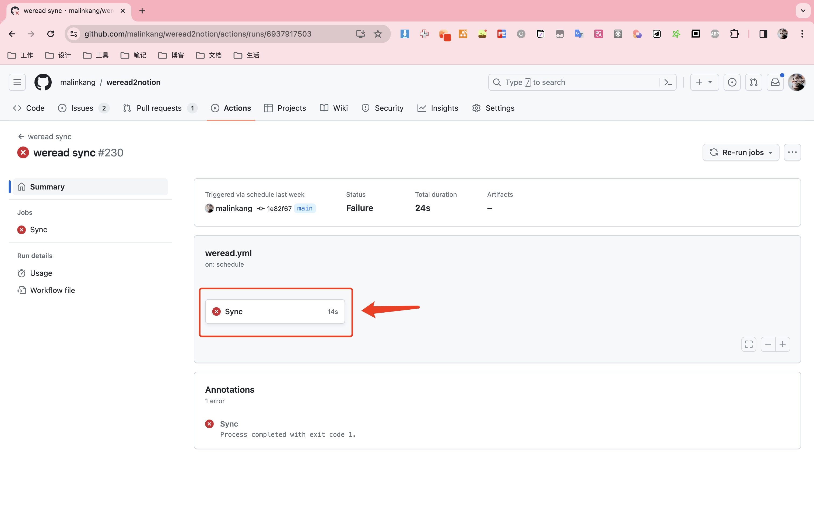

## 问题解答

1. 为什么有的书没有同步过来

> 本项目只会同步划线或者做了笔记的书，书架里的书如果没有划线或者做笔记是不会同步的。后续可能会考虑增加同步书架中的书。

2. 每天何时同步

> 本项目设置的是utc时间的0点，如果你在中国，那就是每天8点同步。不过据我观察，Github这个可能有延迟，会在每天8点零几分同步。你也可以自行修改同步时间，具体参考[这里](https://docs.github.com/zh/actions/using-workflows/events-that-trigger-workflows#schedule)。

## 升级

打开你Fork的项目，点击Sync fork进行同步

当然你也可以上面使用中提到的步骤重新来一遍。

## 捐赠

如果你觉得项目对你有帮助，可以捐赠。我也会不断的优化项目，并做出其他开源的项目。

### 微信

### 支付宝

## 付费解答

有问题先自行解决，往往失败都是一些小细节没注意导致的。我的文档写的已经足够详细，按照文档来操作基本都能成功。你也可以尝试在群里咨询。不要直接加我微信来让我来解答，这个项目我已经投入了大量时间来开发维护，实在没有更多的精力来一对一解答。如果实在解决不了，可以付费一对一咨询，30元一位。付完款可以微信私聊我。

## 群

欢迎加入微信群讨论。使用中遇到的任何问题，包括Notion的使用，微信读书组队打卡，后续的更新都会在群里讨论。

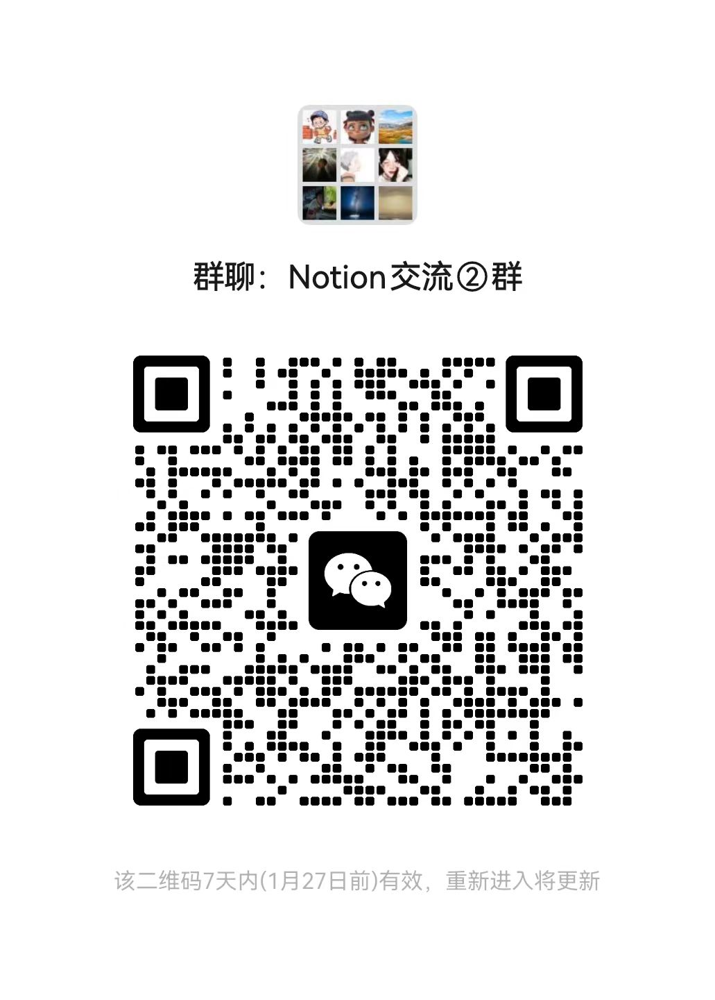

